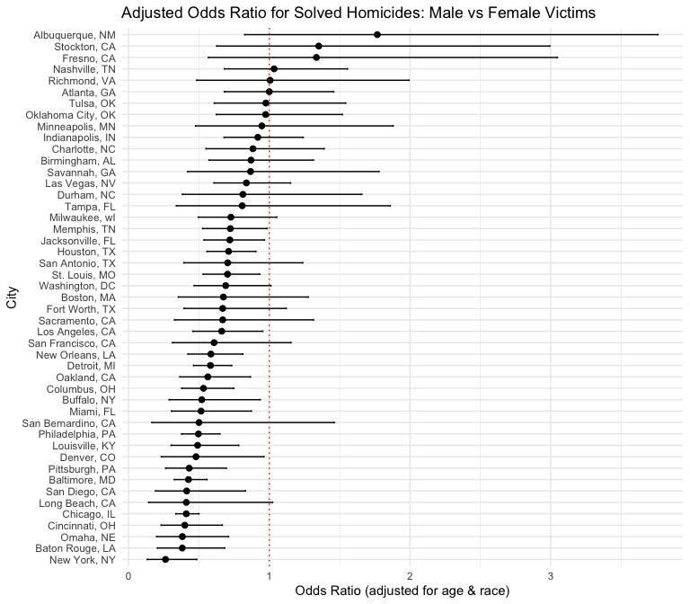
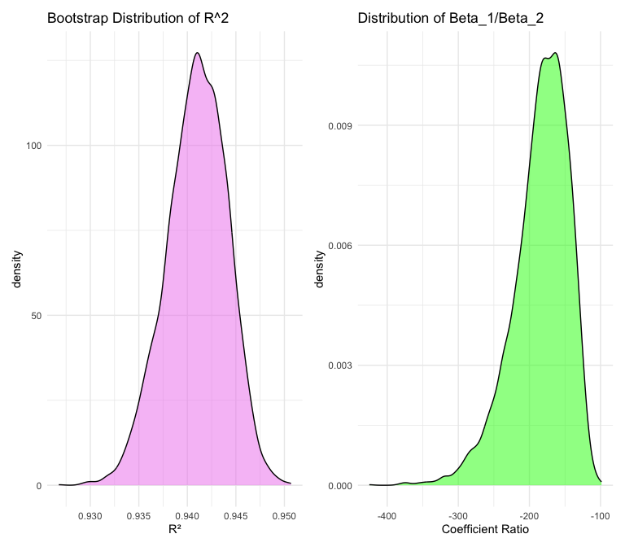
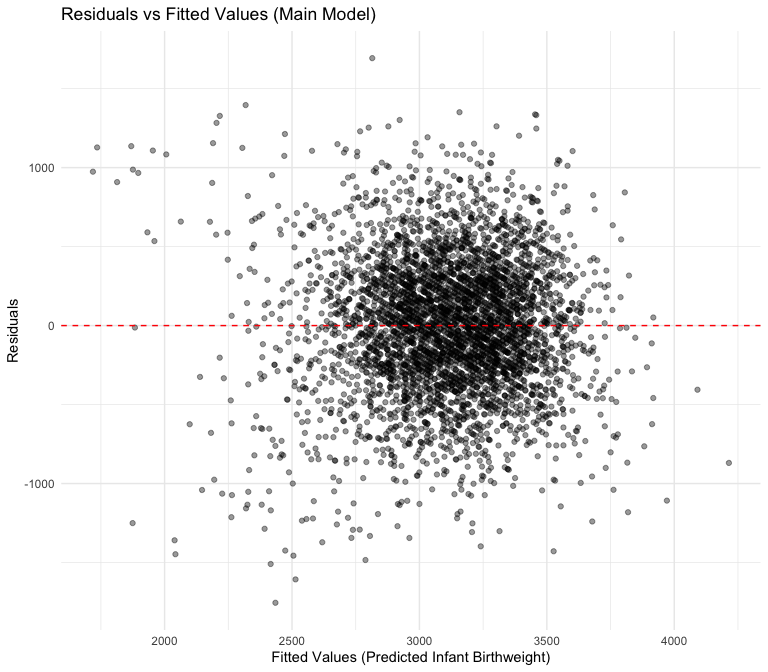
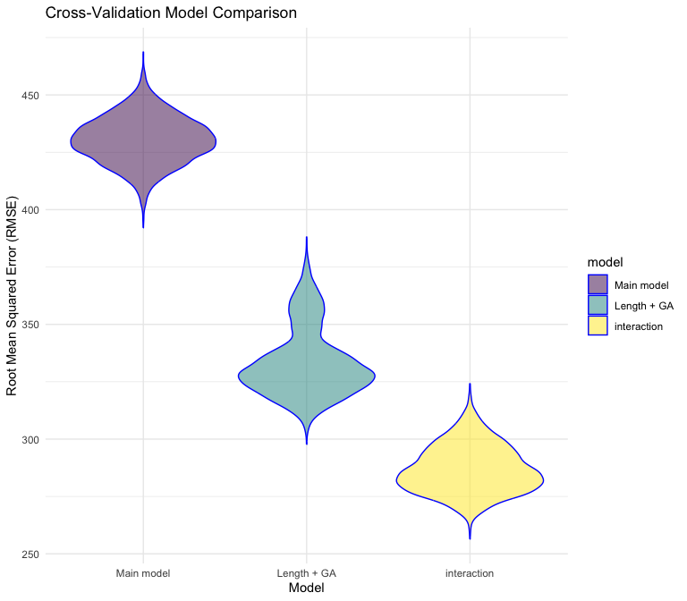

p8105_hw6_zlb2008
================
Zakari L. Billo
2025-12-03

## Problem 1

``` r
homicide_df <- read.csv('data/homicide-data.csv', na = c("NA", ".", "")) |>
  janitor::clean_names() |>
  mutate(
    city_state = str_c(city, ", ", state)
  ) |>
  filter(
    !city_state %in% c("Dallas, TX", "Phoenix, AZ", "Kansas City, MO", "Tulsa, AL"),
    victim_race %in% c("White", "Black")
  ) |>
  mutate(
    victim_age = as.numeric(victim_age),
    case_outcome = ifelse(disposition == "Closed by arrest", 1, 0)
  ) |>
  filter(!is.na(victim_age)) |>
  select(city_state, case_outcome, victim_age, victim_sex, victim_race)
```

    ## Warning: There was 1 warning in `mutate()`.
    ## ℹ In argument: `victim_age = as.numeric(victim_age)`.
    ## Caused by warning:
    ## ! NAs introduced by coercion

glm for Baltimore, MD

``` r
bmore_results <-
  homicide_df |> 
  filter(city_state == "Baltimore, MD") |> 
  glm(
    case_outcome ~ victim_age + victim_sex + victim_race,
    family = binomial(),
    data = _
  ) |> 
  broom::tidy(conf.int = TRUE) |> 
  mutate(
    OR = exp(estimate),
    CL_low = exp(conf.low),
    CL_high = exp(conf.high)
  ) |>
  filter(term == "victim_sexMale") |>
  select(term, log_OR = estimate, OR, CL_low, CL_high, p.value)

bmore_results |> knitr::kable(digits = 3)
```

| term           | log_OR |    OR | CL_low | CL_high | p.value |
|:---------------|-------:|------:|-------:|--------:|--------:|
| victim_sexMale | -0.854 | 0.426 |  0.324 |   0.558 |       0 |

The odds ratio for solved homocides among male victims compared to that
among female victims in Baltimore, MD is 0.426 (95% CI: 0.324, 0.558),
adjusting for victim age and race.

``` r
city_results <-
  homicide_df |> 
  nest(data = -city_state) |> 
  mutate(
    fit = map(
      data,
      ~ glm(case_outcome ~ victim_age + victim_sex + victim_race,
            family = binomial(), data = .x)
    ),
    tidy_fit = map(fit, ~ broom::tidy(.x, conf.int = TRUE))
  ) |>
  unnest(tidy_fit) |>
  filter(term == "victim_sexMale") |>
  mutate(
    OR = exp(estimate),
    CL_low = exp(conf.low),
    CL_high = exp(conf.high)
  ) |>
  select(city_state, OR, CL_low, CL_high, p.value)
```

    ## Warning: There were 43 warnings in `mutate()`.
    ## The first warning was:
    ## ℹ In argument: `tidy_fit = map(fit, ~broom::tidy(.x, conf.int = TRUE))`.
    ## Caused by warning:
    ## ! glm.fit: fitted probabilities numerically 0 or 1 occurred
    ## ℹ Run `dplyr::last_dplyr_warnings()` to see the 42 remaining warnings.

``` r
city_results |> 
  knitr::kable(digits = 3)
```

| city_state         |    OR | CL_low | CL_high | p.value |
|:-------------------|------:|-------:|--------:|--------:|
| Albuquerque, NM    | 1.767 |  0.825 |   3.762 |   0.139 |
| Atlanta, GA        | 1.000 |  0.680 |   1.458 |   1.000 |
| Baltimore, MD      | 0.426 |  0.324 |   0.558 |   0.000 |
| Baton Rouge, LA    | 0.381 |  0.204 |   0.684 |   0.002 |
| Birmingham, AL     | 0.870 |  0.571 |   1.314 |   0.511 |
| Boston, MA         | 0.674 |  0.353 |   1.277 |   0.226 |
| Buffalo, NY        | 0.521 |  0.288 |   0.936 |   0.029 |
| Charlotte, NC      | 0.884 |  0.551 |   1.391 |   0.600 |
| Chicago, IL        | 0.410 |  0.336 |   0.501 |   0.000 |
| Cincinnati, OH     | 0.400 |  0.231 |   0.667 |   0.001 |
| Columbus, OH       | 0.532 |  0.377 |   0.748 |   0.000 |
| Denver, CO         | 0.479 |  0.233 |   0.962 |   0.041 |
| Detroit, MI        | 0.582 |  0.462 |   0.734 |   0.000 |
| Durham, NC         | 0.812 |  0.382 |   1.658 |   0.576 |
| Fort Worth, TX     | 0.669 |  0.394 |   1.121 |   0.131 |
| Fresno, CA         | 1.335 |  0.567 |   3.048 |   0.496 |
| Houston, TX        | 0.711 |  0.557 |   0.906 |   0.006 |
| Indianapolis, IN   | 0.919 |  0.678 |   1.241 |   0.582 |
| Jacksonville, FL   | 0.720 |  0.536 |   0.965 |   0.028 |
| Las Vegas, NV      | 0.837 |  0.606 |   1.151 |   0.278 |
| Long Beach, CA     | 0.410 |  0.143 |   1.024 |   0.072 |
| Los Angeles, CA    | 0.662 |  0.457 |   0.954 |   0.028 |
| Louisville, KY     | 0.491 |  0.301 |   0.784 |   0.003 |
| Memphis, TN        | 0.723 |  0.526 |   0.984 |   0.042 |
| Miami, FL          | 0.515 |  0.304 |   0.873 |   0.013 |
| Milwaukee, wI      | 0.727 |  0.495 |   1.054 |   0.098 |
| Minneapolis, MN    | 0.947 |  0.476 |   1.881 |   0.876 |
| Nashville, TN      | 1.034 |  0.681 |   1.556 |   0.873 |
| New Orleans, LA    | 0.585 |  0.422 |   0.812 |   0.001 |
| New York, NY       | 0.262 |  0.133 |   0.485 |   0.000 |
| Oakland, CA        | 0.563 |  0.364 |   0.867 |   0.009 |
| Oklahoma City, OK  | 0.974 |  0.623 |   1.520 |   0.908 |
| Omaha, NE          | 0.382 |  0.199 |   0.711 |   0.003 |
| Philadelphia, PA   | 0.496 |  0.376 |   0.650 |   0.000 |
| Pittsburgh, PA     | 0.431 |  0.263 |   0.696 |   0.001 |
| Richmond, VA       | 1.006 |  0.483 |   1.994 |   0.987 |
| San Antonio, TX    | 0.705 |  0.393 |   1.238 |   0.230 |
| Sacramento, CA     | 0.669 |  0.326 |   1.314 |   0.255 |
| Savannah, GA       | 0.867 |  0.419 |   1.780 |   0.697 |
| San Bernardino, CA | 0.500 |  0.166 |   1.462 |   0.206 |
| San Diego, CA      | 0.413 |  0.191 |   0.830 |   0.017 |
| San Francisco, CA  | 0.608 |  0.312 |   1.155 |   0.134 |
| St. Louis, MO      | 0.703 |  0.530 |   0.932 |   0.014 |
| Stockton, CA       | 1.352 |  0.626 |   2.994 |   0.447 |
| Tampa, FL          | 0.808 |  0.340 |   1.860 |   0.619 |
| Tulsa, OK          | 0.976 |  0.609 |   1.544 |   0.917 |
| Washington, DC     | 0.690 |  0.465 |   1.012 |   0.061 |

plot the ORs

``` r
city_results |>
  mutate(city_state = fct_reorder(city_state, OR)) |>
  ggplot(aes(y = city_state, x = OR)) +
  geom_point(size = 2) +
  geom_errorbarh(aes(xmin = CL_low, xmax = CL_high), height = 0.15) +
  geom_vline(xintercept = 1, color = "red", linetype = "dotted") +
  labs(
    title = "Adjusted Odds Ratio for Solved Homicides: Male vs Female Victims",
    x = "Odds Ratio (adjusted for age & race)",
    y = "City"
  ) +
  theme_minimal()
```



The plot of ORs by city shows that most cities have a lower odds of
solving homicide cases for male victims compared to female victims.

Albuquerque, NM; Stockton, CA; and Fresno, CA are the exception given
that they have the highest estimated odds ratios, meaning that homicides
with male victim are more likely to be solved than homicides with female
victims. However, most of these cities’ estimated ORs have confidence
intervals that include the null, implying there is no statistically
significant evidence of a difference in the odds of solving homicides
between male and female victims.

New York, NY; Baton Rouge, LA; and Omaha, NE have the lowest odds of
solving homicide cases for male victims compared to female victims. The
OR confidence intervals for these cities is below 1, providing
statistically significant evidence for lower solve rates among
male-victim cases.

## Problem 2

``` r
data("weather_df")
set.seed(1)

bootstrap_results <-
  weather_df |>
  bootstrap(n = 5000) |>
  mutate(
    models = map(strap, \(df) lm(tmax ~ tmin + prcp, data = df)),
    results_glance = map(models, broom::glance),
    results_tidy = map(models, broom::tidy)
  ) |>
  select(-strap, -models) |>
  unnest(results_glance) |>
  select(.id, r.squared, results_tidy) |>
  unnest(results_tidy) |>
  select(.id, r.squared, term, estimate) |>
  pivot_wider(
    names_from = term,
    values_from = estimate
  ) |>
  mutate(
    beta_ratio = tmin / prcp
  )
```

make plots

``` r
p1 <- bootstrap_results |>
  ggplot(aes(x = r.squared)) +
  geom_density(fill = "violet", alpha = 0.5) +
  labs(title = "Bootstrap Distribution of R^2", x = "R²")

p2 <- bootstrap_results |>
  ggplot(aes(x = beta_ratio)) +
  geom_density(fill = "green", alpha = 0.5) +
  labs(title = "Distribution of Beta_1/Beta_2", x = "Coefficient Ratio")

p1 + p2
```



make table

``` r
ci_results <- 
  bootstrap_results |>
  summarize(
    R_sq_low = quantile(r.squared, 0.025),
    R_sq_high = quantile(r.squared, 0.975),
    beta_ratio_low = quantile(beta_ratio, 0.025),
    beta_ratio_high = quantile(beta_ratio, 0.975)
  )

knitr::kable(ci_results, digits = 3)
```

| R_sq_low | R_sq_high | beta_ratio_low | beta_ratio_high |
|---------:|----------:|---------------:|----------------:|
|    0.934 |     0.947 |       -279.749 |        -125.686 |

The 95% CI for $\frac{\beta_1}{\beta_2}$ is approximately (-278, -126).
The CI does not cross 0, so the ratio is consistently negative and not
due to chance.

## Problem 3

turn relevant vars into factors

``` r
birthweight_df = read_csv("data/birthweight.csv", na = c("NA", ".", "")) |> 
  janitor::clean_names() |> 
  mutate(
    babysex = factor(babysex, levels = c(1, 2),
                     labels = c("Male", "Female")),
    
    frace = factor(frace, 
                   levels = c(1, 2, 3, 4, 8, 9),
                   labels = c("White", "Black", "Asian", "Puerto Rican", "Other", "Unknown")),
    
    mrace = factor(mrace,
                   levels = c(1, 2, 3, 4, 8),
                   labels = c("White", "Black", "Asian", "Puerto Rican", "Other")),
    
    malform = factor(malform, 
                     levels = c(0, 1),
                     labels = c("Absent", "Present"))
  )
```

    ## Rows: 4342 Columns: 20
    ## ── Column specification ────────────────────────────────────────────────────────
    ## Delimiter: ","
    ## dbl (20): babysex, bhead, blength, bwt, delwt, fincome, frace, gaweeks, malf...
    ## 
    ## ℹ Use `spec()` to retrieve the full column specification for this data.
    ## ℹ Specify the column types or set `show_col_types = FALSE` to quiet this message.

``` r
summary(is.na(birthweight_df))
```

    ##   babysex          bhead          blength           bwt         
    ##  Mode :logical   Mode :logical   Mode :logical   Mode :logical  
    ##  FALSE:4342      FALSE:4342      FALSE:4342      FALSE:4342     
    ##    delwt          fincome          frace          gaweeks       
    ##  Mode :logical   Mode :logical   Mode :logical   Mode :logical  
    ##  FALSE:4342      FALSE:4342      FALSE:4342      FALSE:4342     
    ##   malform         menarche        mheight          momage       
    ##  Mode :logical   Mode :logical   Mode :logical   Mode :logical  
    ##  FALSE:4342      FALSE:4342      FALSE:4342      FALSE:4342     
    ##    mrace           parity         pnumlbw         pnumsga       
    ##  Mode :logical   Mode :logical   Mode :logical   Mode :logical  
    ##  FALSE:4342      FALSE:4342      FALSE:4342      FALSE:4342     
    ##    ppbmi            ppwt           smoken          wtgain       
    ##  Mode :logical   Mode :logical   Mode :logical   Mode :logical  
    ##  FALSE:4342      FALSE:4342      FALSE:4342      FALSE:4342

I propose the following predictors drive infant birthweight:

Malformations (malform)

Gestational age (gaweeks)

Maternal age at delivery (momage)

Pre-pregnancy BMI (ppbmi)

Weight gain during pregnancy (wtgain)

Smoking during pregnancy (smoken)

Maternal race (mrace)

Fraternal race (frace)

Family income (fincome)

I removed variables from my model like pnumlbw (previous low birthweight
babies) and parity because they provided no additional explanatory
power. Infant physical measurements (blength, bhead) were ommitted,
since they aren’t predictive of the infants birthweight at delivery.

``` r
main_bw_model =
  lm(
    bwt ~ malform + gaweeks + momage + ppbmi + wtgain + smoken + mrace + frace + fincome,
    data = birthweight_df
  )

summary(main_bw_model)
```

    ## 
    ## Call:
    ## lm(formula = bwt ~ malform + gaweeks + momage + ppbmi + wtgain + 
    ##     smoken + mrace + frace + fincome, data = birthweight_df)
    ## 
    ## Residuals:
    ##      Min       1Q   Median       3Q      Max 
    ## -1754.91  -262.56     7.39   278.22  1693.08 
    ## 
    ## Coefficients:
    ##                    Estimate Std. Error t value Pr(>|t|)    
    ## (Intercept)        469.8196    99.2862   4.732 2.29e-06 ***
    ## malformPresent     -47.0367   111.2399  -0.423  0.67243    
    ## gaweeks             53.2336     2.1356  24.927  < 2e-16 ***
    ## momage               2.5622     1.8777   1.365  0.17246    
    ## ppbmi               20.1220     2.0926   9.616  < 2e-16 ***
    ## wtgain              10.0759     0.6101  16.514  < 2e-16 ***
    ## smoken             -11.4155     0.9126 -12.509  < 2e-16 ***
    ## mraceBlack        -193.8020    72.5140  -2.673  0.00755 ** 
    ## mraceAsian         -84.2624   113.1568  -0.745  0.45652    
    ## mracePuerto Rican -101.9117    70.7889  -1.440  0.15004    
    ## fraceBlack         -91.1010    72.6168  -1.255  0.20971    
    ## fraceAsian         -41.2216   109.1678  -0.378  0.70575    
    ## fracePuerto Rican  -84.8900    70.3485  -1.207  0.22761    
    ## fraceOther         -28.6116   116.6876  -0.245  0.80631    
    ## fincome              0.4975     0.2813   1.769  0.07704 .  
    ## ---
    ## Signif. codes:  0 '***' 0.001 '**' 0.01 '*' 0.05 '.' 0.1 ' ' 1
    ## 
    ## Residual standard error: 429.4 on 4327 degrees of freedom
    ## Multiple R-squared:  0.2995, Adjusted R-squared:  0.2972 
    ## F-statistic: 132.1 on 14 and 4327 DF,  p-value: < 2.2e-16

now add residuals

``` r
birthweight_df |> 
  add_predictions(main_bw_model) |> 
  add_residuals(main_bw_model) |> 
  ggplot(aes(x = pred, y = resid)) +
  geom_point(alpha = 0.4) +
  geom_hline(yintercept = 0, color = "red", linetype = "dashed") +
  labs(
    title = "Residuals vs Fitted Values (Main Model)",
    x = "Fitted Values (Predicted Infant Birthweight)",
    y = "Residuals"
  ) +
  theme_minimal()
```



make a simple model and one with interaction

``` r
simple_bw_model =
  lm(bwt ~ blength + gaweeks, data = birthweight_df)

interation_bw_model =
  lm(bwt ~ bhead * blength * gaweeks, data = birthweight_df)
```

compare to main model

``` r
set.seed(1)

cv_df =
  crossv_mc(birthweight_df, n = 5000) |>
  mutate(
    train = map(train, as_tibble),
    test  = map(test,  as_tibble)
  )

cv_df =
  cv_df |>
  mutate(
    main_model = map(train, \(df) lm(bwt ~ malform + gaweeks + momage + ppbmi + wtgain + smoken + mrace + frace + fincome,
    data = df)),
    simple_model = map(train, \(df) lm(bwt ~ blength + gaweeks, data = df)),
    interaction_model  = map(train, \(df) lm(bwt ~ bhead * blength * gaweeks, data = df))
  )

cv_df =
  cv_df |>
  mutate(
    rmse_main = map2_dbl(main_model, test, rmse),
    rmse_simple = map2_dbl(simple_model, test, rmse),
    rmse_interaction  = map2_dbl(interaction_model, test, rmse)
  )

cv_long =
  cv_df |>
  select(starts_with("rmse")) |>
  pivot_longer(
    everything(),
    names_to = "model",
    values_to = "rmse",
    names_prefix = "rmse_"
  ) |>
  mutate(
    model = fct_inorder(recode(model,
                               main   = "Main model",
                               simple = "Length + GA",
                               inter  = "3-way interaction"))
  )

cv_long |>
  ggplot(aes(x = model, y = rmse, fill = model)) +
  geom_violin(alpha = 0.5, color = "blue") +
  scale_fill_viridis_d() +
  labs(
    title = "Cross-Validation Model Comparison",
    x = "Model",
    y = "Root Mean Squared Error (RMSE)"
  ) +
  theme_minimal()
```



The cross-validated RMSE plot shows a large difference in predictive
performance across the models. My main model has by far the highest RMSE
values, meaning it predicting birthweight with the highest error. The
Length + Gestational Age model performs better, with lower RMSE values.
Finally, the full interaction model (incorporates head circumference,
length, sex, and all their lower-order interaction) has the the lowest
RMSE overall and best predictive performance.
